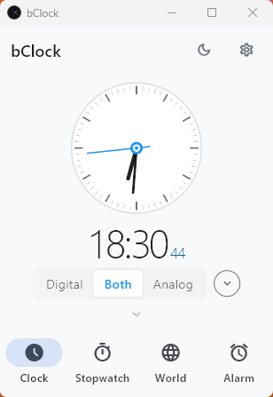
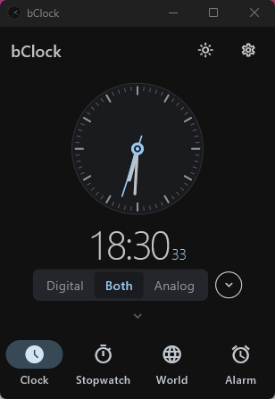

# bClock

A minimalist desktop clock for Windows: an analog or digital clock that sizes its
window to fit, a stopwatch, world clocks, and alarms that ring even when the app
is closed.

Built with Flutter and the [Plinth](https://pub.dev/packages/plinth_components)
UI kit.

| Light | Dark |
|---|---|
|  |  |

## Features

- **Clock** — analog, digital, or both stacked, in three sizes. The window
  resizes itself to fit the clock, and the controls and bottom navigation can be
  collapsed for a bare clock face. Optional *always on top*.
- **Stopwatch** — with laps (fastest and slowest highlighted). A running
  stopwatch keeps counting while the app is closed.
- **World clocks** — pick cities from a list of 39; times are DST-aware and show
  the local zone abbreviation (EST/EDT, CET/CEST…). Shown as analog, digital, or
  both.
- **Alarms** — repeat on chosen weekdays or fire once, with a label, a 5-minute
  snooze, and a looping sound. They also fire when bClock isn't running (see
  [How alarms work](#how-alarms-work)).
- **Languages** — English, Spanish, French and Hebrew (right-to-left), or follow
  the Windows language.
- **Light and dark themes**, and a configurable first day of the week (Sunday or
  Monday).

All settings are remembered between runs.

## Requirements

- Windows 10 or 11
- [Flutter](https://docs.flutter.dev/get-started/install/windows) (stable
  channel; developed on 3.47) with the **Desktop development with C++** workload
  of Visual Studio installed

Other platforms aren't built or supported.

## Getting started

```sh
flutter pub get
flutter run -d windows
```

| Task | Command |
|---|---|
| Static analysis | `flutter analyze` |
| Tests | `flutter test` |
| Release build | `flutter build windows --release` |
| Installer (`setup.exe`) | `iscc /DAppVersion=1.1.0 installer\bclock.iss` |
| MSIX package | `dart run msix:create` |

The release build lands in `build\windows\x64\runner\Release\`.

**Installer (recommended).** [`installer/bclock.iss`](installer/bclock.iss)
packages the release build with [Inno Setup 6](https://jrsoftware.org/isinfo.php)
into `build\installer\bClock_Setup_<version>.exe`. Build the release first;
pass the version from `pubspec.yaml`. It installs per user without an admin
prompt, adds a Start menu entry, and its uninstaller also removes the alarm
scheduled tasks. Unsigned, so SmartScreen warns about an unknown publisher.
CI builds it on every push to `main` (artifact `bclock-setup-<sha>`).

**MSIX.** Configured under `msix_config:` in `pubspec.yaml`. Windows only
installs it when it is signed with a certificate the machine trusts, and
alarms may not fire while the app is closed (see below).

## How alarms work

Alarms fire through two independent paths:

1. **While bClock is running**, it checks the alarm list every 10 seconds and
   shows the alarm popup.
2. **While bClock is closed**, each enabled alarm is also registered as a
   Windows scheduled task named `bClock_alarm_<id>`, which launches
   `bclock.exe --fire <id>`. The tasks are re-synced every time an alarm is
   added, edited, toggled or deleted.

If bClock is already open when a task fires, the launch is handed to the
running window instead of starting a second copy.

The `setup.exe` uninstaller removes the tasks. To remove them by hand:

```powershell
Get-ScheduledTask -TaskName 'bClock_alarm_*' | Unregister-ScheduledTask -Confirm:$false
```

### Known limitations

- An **MSIX-installed** bClock may be sandboxed from registering scheduled
  tasks. The sync then fails silently and alarms only fire while the app is
  open.

## Project layout

```
lib/
  main.dart               App entry, --fire handling, tab shell
  providers/              AppProvider: all settings, persisted
  screens/                Clock, Stopwatch, World, Alarms, Settings
  services/               AlarmService (firing, snooze) and AlarmScheduler
                          (Windows scheduled tasks)
  models/                 AlarmModel, WorldCity
  widgets/                AnalogClock, DigitalClock
  theme/                  Plinth theme and brand colour
  l10n/                   Translations (.arb) and generated localizations
test/                     Widget tests
windows/                  Windows runner
```

State lives in a single `AppProvider` (`provider` package) and is saved to
`SharedPreferences`. For architecture details and conventions — window sizing,
the alarm firing paths, theming rules — see [CLAUDE.md](CLAUDE.md).

## Translations

Strings live in `lib/l10n/app_<lang>.arb`, with English (`app_en.arb`) as the
template. To add a language:

1. Copy `app_en.arb` to `app_<code>.arb`, set `"@@locale"`, and translate the
   values (the `@`-prefixed entries are metadata — don't copy them).
2. Run `flutter gen-l10n` (it also runs as part of `flutter run`/`build`).
3. Add the language to the picker list in
   `lib/screens/settings_screen.dart`.
